<picture>
  <source media="(prefers-color-scheme: dark)" srcset="dark.svg">
  <source media="(prefers-color-scheme: light)" srcset="light.svg">
  
</picture>

  
  
  

I'm Fayaz, a software engineer building enterprise platforms end to end — HRMS, CRM and recruitment systems on Spring Boot and Next.js. I own the full stack: data models and APIs, the React/Next.js front end, auth, deployment and the day-two operations that keep a product alive. Lately most of my time goes into AI-assisted engineering: multi-agent workflows, automation pipelines and LLM-driven developer tooling that turn slow, manual parts of a team's process into something a recruiter or an engineer can run in minutes.

## Featured work

**NuLogic HRMS** — a complete HR management platform (Spring Boot API + Next.js front end) covering employee lifecycle, leave, payroll, performance reviews, expenses and asset tracking, with role-based access across HR, managers and employees. *Private repository.*

- **[nu-recruitment](https://github.com/Fayaz-Deen/nu-recruitment)** — Recruit360, an AI recruitment assistant for in-house recruiters: job-description generation, resume screening with defensible scores, interview-guide creation and candidate communication, with Gemini doing the heavy reading. TypeScript front end and back end.
- **[crm-nu](https://github.com/Fayaz-Deen/crm-nu)** — a personal CRM PWA for contacts, meeting logs, smart follow-up reminders and one-tap communication shortcuts. React 19 + TypeScript front end, Spring Boot back end, installable and offline-capable.
- **[recruit](https://github.com/Fayaz-Deen/recruit)** — a FastAPI recruiter agent that sources candidate profiles, parses resumes (PDF/DOCX) and streams Gemini-powered screening results to a lightweight web UI.
- **[crispy-kitchen](https://github.com/Fayaz-Deen/crispy-kitchen)** — production website for a restaurant in Madurai on Next.js App Router and Tailwind CSS 4, scoring 96 / 100 / 100 / 100 on Lighthouse. [Live site](https://crispykitchen.in).

Alongside these, several products are in active development in private repositories — I'll surface them here as they ship.

## GitHub stats

<picture>
  <source media="(prefers-color-scheme: dark)" srcset="https://github-profile-summary-cards.vercel.app/api/cards/profile-details?username=Fayaz-Deen&theme=github_dark&animation=load&duration=2">
  
</picture>

<table>
  <tr>
    <td width="50%">
      <picture>
        <source media="(prefers-color-scheme: dark)" srcset="https://github-profile-summary-cards.vercel.app/api/cards/stats?username=Fayaz-Deen&theme=github_dark&animation=load&duration=2">
        
      </picture>
    </td>
    <td width="50%">
      <picture>
        <source media="(prefers-color-scheme: dark)" srcset="https://github-profile-summary-cards.vercel.app/api/cards/repos-per-language?username=Fayaz-Deen&theme=github_dark&animation=load&duration=2">
        
      </picture>
    </td>
  </tr>
</table>

<picture>
  <source media="(prefers-color-scheme: dark)" srcset="https://github-readme-streak-stats.herokuapp.com/?user=Fayaz-Deen&theme=github-dark-blue&hide_border=true">
  
</picture>

## Tools I work with

**Languages and product stack**

  
  
  
  
  
  
  
  
  

**AI systems and agents**

  
  
  
  
  

**Data, infrastructure and delivery**

  
  
  
  
  
  
  
  

📫 Reach me at [fayaz30395@gmail.com](mailto:fayaz30395@gmail.com).
